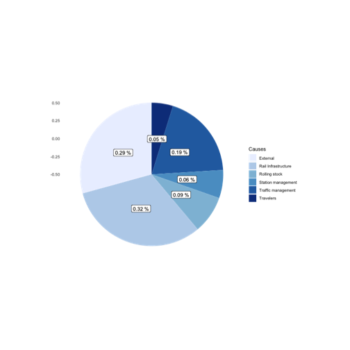
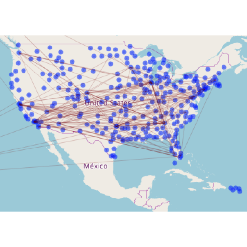

Data Analytics Project
========================================================
author: Max TEIGER,     Clément HALBEHER,    Mathis MAUNICK
date: 2019
autosize: true

Introduction
========================================================

This application was developed as part of a data analysis course at ECE Paris.
we will analyze diiferents aggregations from data of:

- SNCF Train (per year 2015, 2016, 2017, 2018)
- US flights


Trains Data
========================================================


```
[1] "Numbers of rows and columns : 5462, 27"
```

```
 [1] "year"                            "month"                          
 [3] "service"                         "departure_station"              
 [5] "arrival_station"                 "journey_time_avg"               
 [7] "total_num_trips"                 "num_of_canceled_trains"         
 [9] "comment_cancellations"           "num_late_at_departure"          
[11] "avg_delay_late_at_departure"     "avg_delay_all_departing"        
[13] "comment_delays_at_departure"     "num_arriving_late"              
[15] "avg_delay_late_on_arrival"       "avg_delay_all_arriving"         
[17] "comment_delays_on_arrival"       "delay_cause_external_cause"     
[19] "delay_cause_rail_infrastructure" "delay_cause_traffic_management" 
[21] "delay_cause_rolling_stock"       "delay_cause_station_management" 
[23] "delay_cause_travelers"           "num_greater_15_min_late"        
[25] "avg_delay_late_greater_15_min"   "num_greater_30_min_late"        
[27] "num_greater_60_min_late"        
```


Distribution of causes of delay
========================================================




Some relevant values
========================================================


```
[1] "On all years number of trains : 1492939"
```

```
[1] "Number of delayed trains at departure :227097"
```

```
[1] "On average 15 % are late"
```

```
[1] "17 min is the average time of late trains on departure"
```


Plains Data
========================================================


```
[1] "Numbers of rows and columns in flights : 5000, 32"
```

```
[1] "Numbers of rows and columns in airports : 322, 7"
```

```
[1] "Numbers of rows and columns in airlines : 14, 2"
```

The data is centered on the united states
========================================================



Some relevant values
========================================================


```
[1] "The total of flights is 5000"
```

```
[1] "a total distance in kilometers of 4114274 km"
```

```
[1] "Average flight time of 144 minutes"
```

```
[1] "Average distance in kilometers of 823 km"
```


